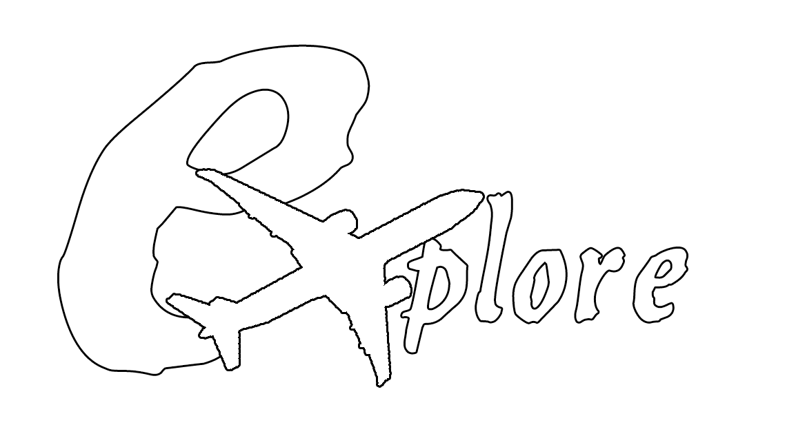

 
#
Upon completion of this project, the application will provide users a service that allows them to create, edit, and organize trips. 
The app will be capable of rendering a map view along with the list of destinations of each trip and the details of each destination. There will also be a homepage that shows recommended and highly rated trips as well as a list of all the user’s trips. 

### Features 

User authentication

  
New users are redirected to a landing page that allows them to search for a destination. They can then view community plans that correspond to that searched location. They can also create or edit plans, but are required to create a user account or log in to save and share trips as well as chat with others.

Travel Plans

  
Users can create a travel plan that include: Travel Methods (bus, subway, car, ferry, plane, gondola, etc.), Places to Visit (museums, landmarks, restaurants, national parks), or Nearby Events:(shows, tours, concerts, etc.). Users can share their plans with other users and can edit them with shared users at the simultaneously. Users can add pre-made plans to their own. Users can view other trips/templates and copy/add them to their own trips.

Search

  
When editing a travel plan, users can explore nearby places to visit by using a search bar. The displayed result will be a list of places of interests that they can add to their travel plan.

Schedules

  
Users can create plans with or without schedules. Trips with schedules will be reflected on the calendar.

Map

  
A map will be displayed in the background of the travel plan editing page. It will be navigable, and can show pins of the places to visit in the itinerary. Users can also view the distance between those places, information is displayed about each place when the pin is clicked.

Chat

  
Users can message each other when editing a travel plan together to get detailed information/feedback about shared plans.

Layout

 
The color theme of the app is intended to have a friendly, inviting, contemporary feel and include the ability to switch to a dark mode layout. The app name will be Explore (logo by Brian Crouse) since that is what we want the user to feel empowered to do.

## Team
### Full-Stack Developers: 
Nicholas Adam 
Jeremy Biagiotti 
Joseph Chou 
Brian Crouse 
Grant Deedler  
Daniel Elliot 
Cathy Mosinski 
| | | |
|:---------------------:|:---------------------:|:---------------------:|
|Architecture Owner|Product Manager|UI Owner|
|Grant Deedler|Cathy Mosinski|Brian Crouse|

## Tech Used

